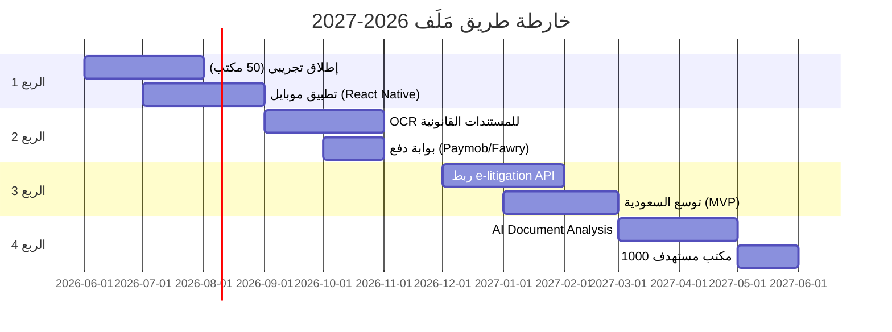

# 📊 خطة جاهزية المستثمر — مَلَف (Malaf)
# منصة SaaS لإدارة مكاتب المحاماة المصرية

---

## 1. السردية الاستثمارية

### المشكلة
> **80,000+ محامٍ مصري** يديرون مكاتبهم بـ Excel وأجندات ورقية وWhatsApp شخصي.

- ضياع مواعيد جلسات → غرامات وخسائر مالية
- لا توجد متابعة فواتير → 40% تأخر في التحصيل
- لا يوجد نظام عربي متكامل → الحلول الأجنبية (Clio/MyCase) لا تدعم القانون المصري
- المحامي يقضي 30% من وقته في إدارة لا في ممارسة القانون

### الحل
> **مَلَف** — أول منصة SaaS عربية مصممة خصيصاً للقانون المصري.

- إدارة قضايا + جلسات + مواعيد + فواتير إلكترونية (ETA)
- بوت واتساب ذكي (8 أوامر) + ذكاء اصطناعي (Gemini)
- حساب مواعيد الطعن والاستئناف تلقائياً (40 يوم مدني، 10 أيام جنائي)
- بوابة موكلين + غرف فيديو للاستشارات عن بُعد
- تشفير AES-256-GCM + عزل بيانات كامل (Multi-tenant RLS)

### الجذب (Traction)
- ✅ MVP مكتمل: 12 وحدة تعمل بالكامل
- ✅ 0 ثغرات أمنية (npm audit)
- ✅ متوافق مع الفاتورة الإلكترونية (ETA)
- ✅ منشور على Render + Supabase (production-ready)
- 🎯 الهدف: 50 مكتب في أول 6 أشهر

---

## 2. سيناريو العرض التجريبي (Demo Script)

### الترتيب: 8 دقائق

| الدقيقة | الصفحة | ما تقوله | ما تُظهره |
|---------|--------|---------|----------|
| 0:00-0:30 | **تسجيل الدخول** | "تسجيل دخول بـ Google أو بريد إلكتروني" | Google OAuth → Dashboard |
| 0:30-1:30 | **لوحة التحكم** | "نظرة شاملة: قضايا، جلسات اليوم، فواتير متأخرة" | الأرقام + الرسوم البيانية |
| 1:30-3:00 | **إدارة القضايا** | "إنشاء قضية بأنواع مصرية (عمالي، إيجارات، ضرائب)" | إنشاء قضية → حالات → جلسات |
| 3:00-4:00 | **تقويم الجلسات** | "حساب مواعيد الطعن تلقائياً مع مراعاة العطلة القضائية" | إضافة جلسة → حساب موعد الاستئناف |
| 4:00-5:00 | **المالية** | "فاتورة إلكترونية متوافقة مع ETA + QR Code" | إنشاء فاتورة → عرض QR |
| 5:00-6:00 | **واتساب** | "المحامي يرسل 'جلسة 1045 تأجلت' → يتسجل تلقائياً" | عرض أوامر البوت |
| 6:00-7:00 | **غرف الفيديو** | "استشارة عن بُعد مع الموكل + ملاحظات مباشرة" | إنشاء غرفة → فتح الرابط |
| 7:00-8:00 | **الأمان** | "تشفير AES-256 + عزل بيانات + JWT" | عرض Security headers |

### نصائح العرض:
- ابدأ بقصة محامٍ حقيقي ضاع منه موعد استئناف
- استخدم بيانات تجريبية واقعية (أسماء مصرية، محاكم حقيقية)
- أنهِ بـ "كل هذا بـ 200 ج.م/شهر"

---

## 3. أسئلة المستثمرين المتوقعة

### س1: "ليه محامي مصري يدفع لمنصة وهو بيستخدم Excel ببلاش؟"
> **ج:** Excel لا يحسب مواعيد الطعن، لا يُرسل تنبيهات، ولا يتوافق مع الفاتورة الإلكترونية الإلزامية. مع بداية إلزام الفاتورة الإلكترونية للمهن الحرة، كل محامٍ سيحتاج نظام — نحن الخيار الوحيد المصري.

### س2: "إيه اللي يمنع Clio من دخول السوق المصري؟"
> **ج:** Clio مصمم للقانون الأمريكي (Common Law). القانون المصري (مدني فرنسي) مختلف جذرياً: أنواع القضايا، مواعيد الطعن، الدوائر، العطلة القضائية، التوكيلات. التعريب ليس ترجمة — بل إعادة بناء كاملة. نحن مبنيون من الصفر للسوق المصري.

### س3: "كيف تكسبون المال؟"
> **ج:** اشتراك شهري (SaaS): Starter 200ج.م، Pro 500ج.م، Enterprise حسب الطلب. الـ LTV المتوقع = 18 شهر × 350ج.م = 6,300 ج.م. الـ CAC المستهدف < 500 ج.م (عبر نقابة المحامين + WhatsApp marketing).

### س4: "إيه خطة النمو؟"
> **ج:** المرحلة 1: مصر (80K محامي). المرحلة 2: السعودية (50K) + الإمارات (20K) — نفس اللغة، قوانين مختلفة. المرحلة 3: شمال أفريقيا. البوت الواتساب يعمل في كل سوق عربي بدون تعديل.

### س5: "فريقكم مين؟"
> **ج:** [أكمل حسب فريقك الفعلي — مؤسس تقني + مؤسس قانوني مثالي]

---

## 4. حجم السوق (بالجنيه المصري)

```
┌─────────────────────────────────────────────┐
│  TAM (السوق الكلي المتاح)                   │
│  محامو العالم العربي: 300,000 محامي          │
│  × 400 ج.م/شهر × 12 = 1.44 مليار ج.م/سنة  │
├─────────────────────────────────────────────┤
│  SAM (السوق القابل للخدمة)                  │
│  محامو مصر: 80,000 محامي                    │
│  × 350 ج.م/شهر × 12 = 336 مليون ج.م/سنة   │
├─────────────────────────────────────────────┤
│  SOM (السوق القابل للتحقيق - 3 سنوات)      │
│  2% من محامي مصر = 1,600 مكتب              │
│  × 400 ج.م/شهر × 12 = 7.68 مليون ج.م/سنة  │
└─────────────────────────────────────────────┘
```

**مصادر الأرقام:**
- نقابة المحامين المصرية: ~80,000 محامي مقيد (2024)
- نقابة المحامين السعودية: ~50,000 (2024)
- معدل تحويل SaaS في الأسواق الناشئة: 1-3% في أول 3 سنوات

---

## 5. مصفوفة المنافسة

| الميزة | مَلَف | Clio | MyCase | LawMaster (مصري) | Excel |
|--------|-------|------|--------|-----------------|-------|
| **واجهة عربية RTL** | ✅ كامل | ❌ | ❌ | ✅ جزئي | ❌ |
| **أنواع قضايا مصرية** | ✅ 9 أنواع | ❌ | ❌ | ✅ 4 أنواع | ❌ |
| **حساب مواعيد الطعن** | ✅ تلقائي | ❌ | ❌ | ❌ | ❌ |
| **الفاتورة الإلكترونية (ETA)** | ✅ QR+كود | ❌ | ❌ | ❌ | ❌ |
| **بوت واتساب** | ✅ 8 أوامر | ❌ | ❌ | ❌ | ❌ |
| **ذكاء اصطناعي** | ✅ Gemini+Groq | ✅ | ✅ محدود | ❌ | ❌ |
| **غرف فيديو** | ✅ Daily.co | ✅ Zoom | ❌ | ❌ | ❌ |
| **تشفير بيانات** | ✅ AES-256 | ✅ | ✅ | ❌ | ❌ |
| **السعر/شهر** | 200 ج.م | ~3000 ج.م | ~2500 ج.م | 800 ج.م | مجاني |
| **بوابة موكلين** | ✅ | ✅ | ✅ | ❌ | ❌ |

**الميزة التنافسية الأساسية:** بوت واتساب + ETA + مواعيد الطعن = ثلاثية لا يملكها أي منافس.

---

## 6. خارطة الطريق — 12 شهر



| الربع | الأولوية | التفاصيل |
|-------|---------|---------|
| **Q3 2026** | 📱 تطبيق موبايل | React Native — إشعارات push للجلسات |
| **Q4 2026** | 📄 OCR | استخراج بيانات من صحف الدعاوى والأحكام تلقائياً |
| **Q4 2026** | 💳 بوابة دفع | Paymob/Fawry — تحصيل الأتعاب أونلاين |
| **Q1 2027** | ⚖️ e-Litigation | ربط مع بوابة التقاضي الإلكتروني (وزارة العدل) |
| **Q2 2027** | 🤖 AI Docs | تحليل عقود وأحكام بالذكاء الاصطناعي |

---

## 7. هيكل التسعير

| | Starter | Pro | Enterprise |
|--|---------|-----|-----------|
| **السعر** | **200 ج.م/شهر** | **500 ج.م/شهر** | **حسب الطلب** |
| المستخدمون | 2 | 10 | غير محدود |
| القضايا | 50 | غير محدود | غير محدود |
| التخزين | 1 GB | 10 GB | غير محدود |
| إدارة القضايا | ✅ | ✅ | ✅ |
| تقويم الجلسات | ✅ | ✅ | ✅ |
| الفواتير | ✅ | ✅ | ✅ |
| ETA (فاتورة إلكترونية) | ❌ | ✅ | ✅ |
| بوت واتساب | ❌ | ✅ | ✅ |
| غرف الفيديو | ❌ | ✅ | ✅ |
| ذكاء اصطناعي | ❌ | ✅ | ✅ |
| بوابة موكلين | ❌ | ✅ | ✅ |
| OCR (قريباً) | ❌ | ❌ | ✅ |
| API مخصص | ❌ | ❌ | ✅ |
| دعم فني | بريد إلكتروني | واتساب + هاتف | مدير حساب مخصص |
| **سنوي (خصم 20%)** | **1,920 ج.م** | **4,800 ج.م** | — |

**اقتصاديات الوحدة:**
- CAC المستهدف: < 500 ج.م
- ARPU: 350 ج.م/شهر
- LTV (18 شهر): 6,300 ج.م
- LTV/CAC: 12.6x ✅

---

## 8. الميزات القاتلة — WhatsApp Bot + AI

### بوت الواتساب (8 أوامر)

```
📱 المحامي يرسل من هاتفه:
┌─────────────────────────────────────┐
│  "جلسة 1045 تأجلت لـ 15/7"         │ → ✅ يُسجل في النظام
│  "موعد 1045 15/7 الساعة 11"         │ → ✅ يُضاف للتقويم
│  "مصروف 350 رسوم قلم"              │ → ✅ يُسجل كمصروف
│  "اليوم"                            │ → ✅ قائمة جلسات اليوم
│  "فاتورة 01012345678"              │ → ✅ فواتير الموكل
│  "ذكرني اتصل بأحمد الساعة 3"       │ → ✅ تذكير مجدول
│  "موكل جديد محمد علي 01098765432"  │ → ✅ إنشاء ملف
│  "وصلت محكمة شمال القاهرة"         │ → ✅ تسجيل حضور GPS
└─────────────────────────────────────┘
```

**لماذا هذا قاتل؟**
- 95% من المحامين المصريين يستخدمون واتساب يومياً
- لا يحتاج فتح المنصة — يعمل من شاشة المحادثات
- يعمل بدون إنترنت سريع (رسائل نصية فقط)

### الذكاء الاصطناعي

```
┌─────────────────────────────────────┐
│  الموكل يسأل على واتساب:           │
│  "إيه آخر أخبار قضيتي؟"            │
│           ↓                         │
│  Gemini 1.5 Flash + سياق القضايا    │
│           ↓                         │
│  "القضية رقم 1045 حالتها متداولة.   │
│   آخر جلسة: 1/5 — تأجلت لـ 15/7.   │
│   للتفاصيل تواصل مع المكتب."       │
└─────────────────────────────────────┘

سلسلة Fallback: Gemini → Groq → رد افتراضي
```

---

## ملحق: الأرقام الرئيسية للعرض

| المقياس | القيمة |
|---------|--------|
| وحدات المنصة | 12 وحدة مكتملة |
| أوامر الواتساب | 8 أوامر |
| سياسات أمان RLS | 30+ سياسة |
| ثغرات أمنية | 0 |
| أنواع القضايا المصرية | 9 أنواع |
| حالات القضايا | 8 حالات |
| أنواع التوكيلات | 5 أنواع |
| مواعيد الطعن | 5 أنواع + عطلة قضائية |
| سعر البداية | 200 ج.م/شهر |
| حجم السوق (SAM) | 336 مليون ج.م/سنة |
