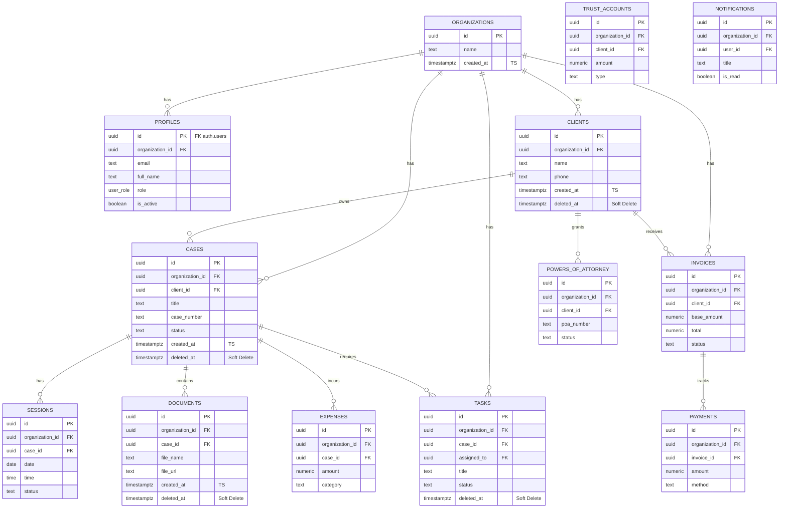

# Database ERD - malaf.pro

```mermaid
erDiagram
    ORGANIZATIONS ||--o{ PROFILES : "has"
    ORGANIZATIONS ||--o{ CLIENTS : "has"
    ORGANIZATIONS ||--o{ CASES : "has"
    ORGANIZATIONS ||--o{ INVOICES : "has"
    ORGANIZATIONS ||--o{ TASKS : "has"

    CLIENTS ||--o{ CASES : "owns"
    CLIENTS ||--o{ POWERS_OF_ATTORNEY : "grants"
    CLIENTS ||--o{ INVOICES : "receives"

    CASES ||--o{ SESSIONS : "has"
    CASES ||--o{ DOCUMENTS : "contains"
    CASES ||--o{ TASKS : "requires"
    CASES ||--o{ EXPENSES : "incurs"

    INVOICES ||--o{ PAYMENTS : "tracks"

    ORGANIZATIONS {
        uuid id PK
        text name
        timestamptz created_at "TS"
    }

    PROFILES {
        uuid id PK "FK auth.users"
        uuid organization_id FK
        text email
        text full_name
        user_role role
        boolean is_active
    }

    CLIENTS {
        uuid id PK
        uuid organization_id FK
        text name
        text phone
        timestamptz created_at "TS"
        timestamptz deleted_at "Soft Delete"
    }

    CASES {
        uuid id PK
        uuid organization_id FK
        uuid client_id FK
        text title
        text case_number
        text status
        timestamptz created_at "TS"
        timestamptz deleted_at "Soft Delete"
    }

    SESSIONS {
        uuid id PK
        uuid organization_id FK
        uuid case_id FK
        date date
        time time
        text status
    }

    POWERS_OF_ATTORNEY {
        uuid id PK
        uuid organization_id FK
        uuid client_id FK
        text poa_number
        text status
    }

    DOCUMENTS {
        uuid id PK
        uuid organization_id FK
        uuid case_id FK
        text file_name
        text file_url
        timestamptz created_at "TS"
        timestamptz deleted_at "Soft Delete"
    }

    INVOICES {
        uuid id PK
        uuid organization_id FK
        uuid client_id FK
        numeric base_amount
        numeric total
        text status
    }

    PAYMENTS {
        uuid id PK
        uuid organization_id FK
        uuid invoice_id FK
        numeric amount
        text method
    }

    EXPENSES {
        uuid id PK
        uuid organization_id FK
        uuid case_id FK
        numeric amount
        text category
    }

    TRUST_ACCOUNTS {
        uuid id PK
        uuid organization_id FK
        uuid client_id FK
        numeric amount
        text type
    }

    TASKS {
        uuid id PK
        uuid organization_id FK
        uuid case_id FK
        uuid assigned_to FK
        text title
        text status
        timestamptz deleted_at "Soft Delete"
    }

    NOTIFICATIONS {
        uuid id PK
        uuid organization_id FK
        uuid user_id FK
        text title
        boolean is_read
    }
```
