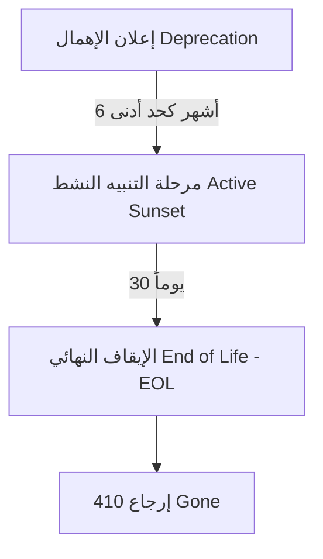

# API Deprecation & Sunset Policy — malaf.pro

لضمان انتقال سلس للمطورين والعملاء عند الانتقال من إصدار قديم لـ API إلى إصدار أحدث، تلتزم منصة **ملف** بالسياسة الأمنية والتشغيلية التالية للإهمال والإيقاف (Deprecation & Sunset).

---

## 1. الجدول الزمني لمراحل الإيقاف (Timeline)

عند الإعلان عن إصدار جديد (v2) واعتبار الإصدار القديم (v1) مهملًا، يمر الإصدار القديم بثلاث مراحل أساسية:



1. **إعلان الإهمال (Deprecation Announcement)**:
   * يتم إرسال بريد إلكتروني رسمي وإشعار على لوحة التحكم لكافة المستخدمين والمطورين المسجلين.
   * يتم تضمين ترويسات الاستجابة الخاصة بالإهمال (HTTP Headers) في كافة ردود الإصدار القديم.
   * يستمر دعم الإصدار القديم وحل المشكلات الحرجة لمدة **6 أشهر كحد أدنى**.

2. **فترة التنبيه النشط (Active Sunset Period)**:
   * قبل 30 يوماً من الإيقاف النهائي، يتم تفعيل التنبيهات المكثفة.
   * يتم التواصل المباشر مع العملاء الذين لا يزالون يرسلون طلبات نشطة إلى الـ API القديم.

3. **الإيقاف النهائي (Sunset / End of Life)**:
   * يُغلق المسار القديم تماماً.
   * يُرجع الخادم رمز الاستجابة `410 Gone` مع رسالة واضحة تشير إلى ضرورة الترقية إلى الإصدار الأحدث.

---

## 2. ترويسات الاستجابة المعتمدة (HTTP Headers)

لضمان وعي الأنظمة والبرمجيات التي تستهلك الـ API بوضع الإهمال تلقائياً، نلتزم بإرسال الترويسات التالية في كل استجابة من الـ API المهمل:

| الترويسة (Header) | القيمة / الوصف | مثال |
|-------------------|----------------|------|
| `Deprecation` | `true` (للإشارة إلى أن هذا الإصدار مهمل وسيتوقف) | `Deprecation: true` |
| `Sunset` | التاريخ المتوقع لإيقاف الخدمة نهائياً (RFC 7231) | `Sunset: Thu, 31 Dec 2026 23:59:59 GMT` |
| `Link` | رابط يوجه إلى توثيق الإصدار الجديد ودليل الهجرة | `Link: <https://docs.malaf.pro/api/v2/migration>; rel="successor-version"` |

---

## 3. آلية إدراج الترويسات في الكود (Supabase / Deno Edge Function)

يتم تطبيق الترويسات في كود معالجة الاستجابات كما في المثال التالي:

```typescript
export async function handleDeprecatedResponse(response: Response, successorUrl: string, sunsetDateGMT: string): Promise<Response> {
  // إضافة الترويسات للحفاظ على وعي الأنظمة المستهلكة
  response.headers.set('Deprecation', 'true');
  response.headers.set('Sunset', sunsetDateGMT);
  response.headers.set('Link', `<${successorUrl}>; rel="successor-version"`);
  
  return response;
}
```
