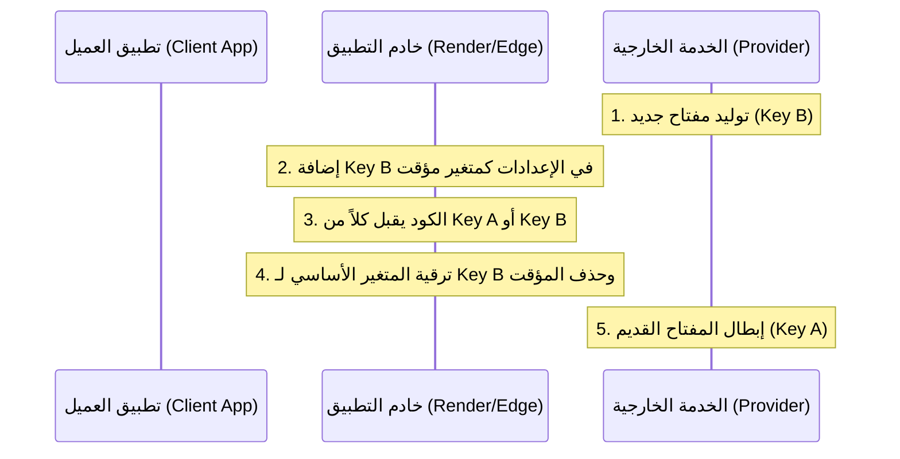

# Secrets Rotation Runbook — malaf.pro

دليل تشغيلي شامل يوضح بالتفصيل خطوات تدوير كافة المفاتيح البرمجية والأسرار لمنصة **ملف** مع الحفاظ على صفر انقطاع بالخدمة (Zero-Downtime) باتباع نمط الكتابة المزدوجة (Double-Write Pattern).

---

## 1. نمط الكتابة المزدوجة (Double-Write Pattern)

عند تدوير سر حساس مثل `GEMINI_API_KEY` أو مفتاح تشفير البيانات، نلتزم بالخطوات العامة التالية لتفادي انقطاع الخدمة:



---

## 2. خطوات تدوير الأسرار الخارجية (Paymob / Gemini / Meta)

### 🔑 تدوير مفتاح Gemini AI API Key:
1. اذهب إلى [Google AI Studio](https://aistudio.google.com/) وعمليات إدارة المفاتيح.
2. أنشئ مفتاحاً جديداً بالكامل (`Key_New`).
3. افتح لوحة تحكم Render.com لخدمة السيرفر.
4. أضف متغيراً بيئياً جديداً باسم مؤقت:
   `GEMINI_API_KEY_NEW=AIzaSy...[المفتاح الجديد]`
5. تأكد من أن الكود البرمجي يدعم تذوق كلا المفتاحين (يستخدم `NEW` أولاً ثم يتراجع إلى القديم):
   ```typescript
   const apiKey = process.env.GEMINI_API_KEY_NEW ?? process.env.GEMINI_API_KEY;
   ```
6. قم بعمل Deploy للنسخة وتأكد من عمل الميزات بشكل طبيعي.
7. استبدل قيمة `GEMINI_API_KEY` بالكامل بقيمة المفتاح الجديد.
8. قم بإلغاء المتغير المؤقت `GEMINI_API_KEY_NEW`.
9. قم بعمل Deploy نهائي.
10. اذهب إلى لوحة Google AI Studio وقم بإبطال وحذف المفتاح القديم.

---

## 3. خطوات الطوارئ والرجوع (Rollback Procedure)

في حالة فشل أو تعطل النظام أثناء أي خطوة من خطوات التدوير:
1. **تجميد فوري للعملية**: لا تقم بإبطال أي مفتاح قديم في لوحة مزود الخدمة حتى تتأكد من استقرار المفتاح الجديد بنسبة 100%.
2. **استرجاع النسخة الاحتياطية**: أعد ضبط المتغيرات البيئية في Render/Supabase إلى القيم القديمة المخزنة مسبقاً.
3. **إعادة تشغيل الخوادم (Redeploy)**: قم بعمل إعادة تشغيل للـ Services فوراً لإعادة تحميل الأسرار القديمة والصالحة للعمل.
4. **التحقيق والتدقيق**: افحص سجلات الأخطاء في Sentry لمعرفة سبب الرفض (مثال: عدم ملاءمة صلاحيات المفتاح الجديد أو خطأ في التهجئة).
