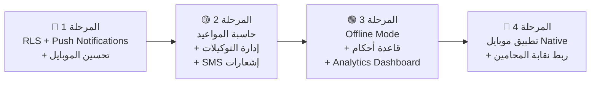

# 📊 تحليل أعمال منصة مَلَف — التسعير والتكاليف والاستراتيجية

## الجزء الأول: تحليل التكاليف الحقيقية

### 💸 تكاليف البنية التحتية الشهرية (عند 1,000 مكتب)

| البند                                       | التكلفة الشهرية ($) | بالجنيه المصري    |
| ------------------------------------------- | ------------------- | ----------------- |
| **Supabase Pro/Team** (DB + Auth + Storage) | $300–600            | 15,000–30,000     |
| **Render** (App Server + API)               | $50–150             | 2,500–7,500       |
| **Gemini API** (AI — صياغة/تلخيص)           | $100–300            | 5,000–15,000      |
| **Groq API** (AI — سرعة عالية)              | $50–150             | 2,500–7,500       |
| **WhatsApp Business API** (Meta)            | $100–250            | 5,000–12,500      |
| **Daily.co** (مكالمات فيديو)                | $50–100             | 2,500–5,000       |
| **Domain + CDN + SSL**                      | $20                 | 1,000             |
| **Email Service** (إشعارات)                 | $30                 | 1,500             |
| **Monitoring** (Sentry/Logs)                | $30                 | 1,500             |
| **نسخ احتياطي + أمان**                      | $50                 | 2,500             |
| **إجمالي البنية التحتية**                   | **$780–1,680**      | **38,000–83,500** |

> [!NOTE]
> التكلفة الفعلية تعتمد على الاستخدام. مع 1,000 مكتب، المتوسط الواقعي **~60,000 ج.م/شهر**.

### 👨‍💼 تكاليف التشغيل (اختياري لكن مهم للنمو)

| البند              | التكلفة الشهرية   |
| ------------------ | ----------------- |
| دعم فني (1-2 شخص)  | 15,000–25,000     |
| تسويق رقمي         | 10,000–30,000     |
| محاسب/مراجع        | 5,000             |
| مصاريف إدارية      | 5,000             |
| **إجمالي التشغيل** | **35,000–65,000** |

### 📊 إجمالي التكاليف الشهرية

| السيناريو                                | التكلفة      |
| ---------------------------------------- | ------------ |
| **الحد الأدنى** (أنت لوحدك + بنية تحتية) | ~60,000 ج.م  |
| **المتوسط** (+ شخص دعم + تسويق خفيف)     | ~100,000 ج.م |
| **النمو** (فريق صغير + تسويق قوي)        | ~150,000 ج.م |

---

## الجزء الثاني: تحليل السوق المصري

### 🏛️ مين عميلك؟

| الشريحة                     | عدد تقريبي في مصر | دخل شهري تقريبي | قدرة الدفع للبرمجيات |
| --------------------------- | ----------------- | --------------- | -------------------- |
| **محامي فردي** (ناشئ)       | ~150,000          | 5,000–15,000    | 99–199 ج.م           |
| **مكتب صغير** (2–5 محامين)  | ~20,000           | 20,000–80,000   | 199–399 ج.م          |
| **مكتب متوسط** (5–15 محامي) | ~5,000            | 80,000–300,000  | 399–799 ج.م          |
| **شركة محاماة** (15+ محامي) | ~1,000            | 300,000+        | 999–2,499 ج.م        |

> [!IMPORTANT]
> **المشكلة الأساسية**: المحامي المصري معتاد على الورق والواتساب. تسعيرك لازم يكون:
>
> 1. **أقل من تكلفة موظف إداري** (الموظف بيكلف 4,000–6,000 ج.م/شهر)
> 2. **أقل من خطأ واحد** (نسيان جلسة = خسارة قضية = خسارة آلاف)
> 3. **في متناول المحامي الناشئ** عشان يبدأ معاك وينمو معاك

---

## الجزء الثالث: التسعير المقترح ✅

### الفلسفة: **ابدأ رخيص → اكسب الثقة → كبّر الحساب**

| الباقة             | السعر الشهري | السعر السنوي (خصم 20%) | الشريحة المستهدفة | الحدود                                           |
| ------------------ | ------------ | ---------------------- | ----------------- | ------------------------------------------------ |
| **المجانية** 🆓    | 0 ج.م        | 0                      | محامي ناشئ يجرب   | 3 موكلين، 5 قضايا، بدون AI                       |
| **الأساسية**       | **149 ج.م**  | 1,430 ج.م/سنة          | محامي فردي        | 30 موكل، 50 قضية، 1 مستخدم، AI محدود             |
| **المحترفة** ⭐    | **349 ج.م**  | 3,350 ج.م/سنة          | مكتب صغير/متوسط   | 200 موكل، 300 قضية، 5 مستخدمين، AI + تنفيذ + CLM |
| **المؤسسات**       | **699 ج.م**  | 6,710 ج.م/سنة          | شركة محاماة       | غير محدود، 20 مستخدم، كل الميزات + بوابة موكلين  |
| **الشركات الكبرى** | **اتصل بنا** | مخصص                   | كيانات كبرى       | مخصص بالكامل + مدير حساب + API                   |

### لماذا هذا التسعير؟

**149 ج.م/شهر** = **5 ج.م/يوم** = أقل من كوب قهوة

- المحامي الناشئ هيقول "ليه لأ؟"
- لو نسي جلسة واحدة، الخسارة أكبر من اشتراك سنة كاملة

**349 ج.م/شهر** = أقل من **10% من راتب موظف إداري**

- المكتب اللي عنده 3 محامين، 349 ج.م بتوفر عليه وقت = فلوس

---

## الجزء الرابع: حسبة الأرباح 💰

### سيناريو الهدف: 1,000 مكتب

| الباقة                 | نسبة العملاء | عدد       | الإيراد الشهري      |
| ---------------------- | ------------ | --------- | ------------------- |
| المجانية               | 30%          | 300       | 0                   |
| الأساسية (149)         | 35%          | 350       | 52,150              |
| المحترفة (349)         | 25%          | 250       | 87,250              |
| المؤسسات (699)         | 8%           | 80        | 55,920              |
| الشركات الكبرى (1500+) | 2%           | 20        | 30,000              |
| **الإجمالي**           |              | **1,000** | **225,320 ج.م/شهر** |

### الربح الصافي

| البند                 | المبلغ                 |
| --------------------- | ---------------------- |
| الإيرادات الشهرية     | 225,320                |
| تكاليف البنية التحتية | -60,000                |
| تكاليف التشغيل        | -50,000                |
| **الربح الصافي**      | **~115,000 ج.م/شهر**   |
| **الربح السنوي**      | **~1,380,000 ج.م/سنة** |

> [!TIP]
> **ده مع 1,000 مكتب فقط**. لو وصلت 3,000 مكتب (وده ممكن في 2-3 سنين):
>
> - الإيرادات: ~675,000 ج.م/شهر
> - التكاليف بتزيد ~30% فقط (اقتصاديات الحجم)
> - الربح: ~500,000 ج.م/شهر = **6 مليون ج.م/سنة**

### خارطة النمو

```
الشهر 1-3:    50 مكتب  → إيرادات ~11,000 ج.م (أنت لسه بتحرق فلوس)
الشهر 4-6:   150 مكتب  → إيرادات ~34,000 ج.م (بتقرب من نقطة التعادل)
الشهر 7-12:  400 مكتب  → إيرادات ~90,000 ج.م (بدأت تربح ✅)
السنة 2:     800 مكتب  → إيرادات ~180,000 ج.م
السنة 3:   1,500 مكتب  → إيرادات ~340,000 ج.م 🚀
```

---

## الجزء الخامس: اللي ناقص المنصة 🔍

### 🏛️ من وجهة نظر قانونية (كمحامي)

| #   | الميزة الناقصة                                                                  | الأهمية | التأثير على المبيعات               |
| --- | ------------------------------------------------------------------------------- | ------- | ---------------------------------- |
| 1   | **حاسبة المواعيد القانونية** — مواعيد الاستئناف والطعن والسقوط تلقائياً         | 🔴 حرجة | عالي جداً — ده الخطأ الأكثر شيوعاً |
| 2   | **إدارة التوكيلات** — سجل توكيلات المحاكم، تواريخ التجديد، وأرقام الشهر العقاري | 🔴 حرجة | عالي — كل محامي بيحتاجها           |
| 3   | **حاسبة الرسوم القضائية** — رسوم المحاكم المصرية حسب نوع الدعوى والمبلغ         | 🟡 مهمة | متوسط — بتوفر وقت                  |
| 4   | **نظام الإنذارات القانونية** — إنشاء وتتبع إنذارات على يد محضر بمراحلها         | 🟡 مهمة | متوسط                              |
| 5   | **ربط بنقابة المحامين** — التحقق من بيانات المحامي، التجديد السنوي              | 🟢 حلوة | منخفض لكن احترافية                 |
| 6   | **حاسبة التعويضات** — حساب الفوائد القانونية والتعويضات التقديرية               | 🟢 حلوة | متوسط                              |
| 7   | **قاعدة أحكام** — أحكام نقض وإبرام مصرية قابلة للبحث                            | 🟡 مهمة | عالي جداً — ميزة تنافسية قاتلة     |
| 8   | **إشعارات SMS للموكلين** — إرسال SMS تذكير بالجلسات                             | 🟡 مهمة | عالي — الموكل بيحب ده              |
| 9   | **نظام المصروفات لكل قضية** — مصروفات الانتقال، الدمغات، الرسوم                 | 🟡 مهمة | متوسط                              |
| 10  | **تصدير بيانات المكتب** — Excel/PDF كامل كنسخة احتياطية                         | 🟢 حلوة | مهم للثقة                          |

### 💻 من وجهة نظر برمجية (كمهندس)

| #   | النقص                                                                        | الأهمية | الحالة الحالية                               |
| --- | ---------------------------------------------------------------------------- | ------- | -------------------------------------------- |
| 1   | **تطبيق موبايل PWA محسن** — المحامي في المحكمة بيستخدم الموبايل 90% من الوقت | 🔴 حرجة | PWA موجود لكن محتاج تحسين UX للموبايل        |
| 2   | **Row Level Security (RLS)** — عزل بيانات كل مكتب عن الآخر في Supabase       | 🔴 حرجة | organization_id موجود لكن RLS policies ناقصة |
| 3   | **Offline Mode** — المحامي ممكن يكون في محكمة بدون إنترنت                    | 🟡 مهمة | غير موجود                                    |
| 4   | **Push Notifications** — تنبيهات الجلسات على الموبايل                        | 🔴 حرجة | غير موجود — ده السبب #1 لاستخدام التطبيق     |
| 5   | **CI/CD Pipeline** — اختبارات تلقائية قبل النشر                              | 🟡 مهمة | غير موجود — بنشر مباشر                       |
| 6   | **Error Monitoring** — Sentry أو LogRocket لرصد الأخطاء في Production        | 🟡 مهمة | غير موجود                                    |
| 7   | **Automated Backups** — نسخ احتياطي يومي مع إمكانية الاستعادة                | 🟡 مهمة | يعتمد على Supabase فقط                       |
| 8   | **Rate Limiting** — حماية من الاستخدام المفرط للـ API                        | 🟢 حلوة | غير موجود                                    |
| 9   | **Data Migration Tools** — أدوات نقل بيانات من Excel/أنظمة أخرى              | 🟡 مهمة | CSV import موجود لكن بدائي                   |
| 10  | **Analytics Dashboard** — لوحة تحكم لك كمؤسس: كم مستخدم نشط، Churn Rate      | 🟡 مهمة | غير موجود                                    |
| 11  | **Multi-language** — دعم الإنجليزية للمكاتب الدولية في مصر                   | 🟢 حلوة | عربي فقط                                     |
| 12  | **Supabase Realtime** — تحديثات فورية بين أعضاء الفريق                       | 🟢 حلوة | غير مفعل                                     |

### 🎯 الأولويات المقترحة (ترتيب التنفيذ)



---

## الجزء السادس: نصيحة أخيرة 🎯

> [!CAUTION]
>
> ### لا تنتظر الكمال قبل الإطلاق!
>
> المنصة الآن فيها **80% من اللي محتاجه أي مكتب محاماة**. الـ 20% الباقية هتعرفها من **ردود العملاء الحقيقيين**.
>
> **خطة الإطلاق المقترحة:**
>
> 1. **الأسبوع القادم**: أطلق نسخة Beta مجانية لـ 10 مكاتب محاماة (أصدقاءك/معارفك)
> 2. **خلال شهر**: اجمع ملاحظاتهم وصلّح
> 3. **الشهر الثاني**: أطلق رسمياً بالتسعير الجديد
> 4. **كل شهر**: أضف ميزة واحدة جديدة بناءً على طلبات العملاء

### المفتاح الذهبي 🔑

**اللي هيخلي المحامي يدفع مش الميزات — لكن إنه يحس إن المنصة فاهماه.** كل ميزة عندك لازم تحل مشكلة حقيقية بيعاني منها يومياً.
