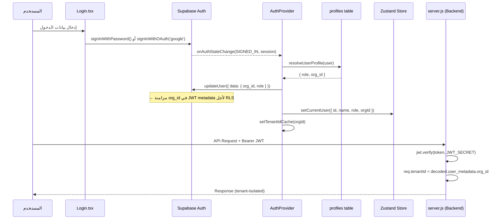

# ⚖️ تقرير R2 — تدقيق Supabase Auth
## مَلَف (Malaf) — مراجعة نظام المصادقة

---

## 1. ما هو نظام Auth المُستخدم فعلياً؟

| السؤال | الإجابة |
|:---|:---|
| **النظام المُستخدم** | **Supabase Auth فقط** — لا يوجد أي نظام آخر |
| Firebase موجود؟ | ❌ **لا** — تم إزالته بالكامل. `tenant.ts` يقول صراحة: `"Firebase has been completely removed"` |
| Auth0 / Clerk / Passport? | ❌ لا يوجد في `package.json` |
| هل يحتاج ترحيل (Migration)? | ❌ **لا يحتاج** — النظام موحد بالفعل |

---

## 2. تدفق المصادقة الكامل (Auth Flow)



---

## 3. فحص كل طبقة

### الطبقة 1: صفحة الدخول ([Login.tsx](file:///e:/malaf/src/views/Login.tsx))

| الآلية | الحالة | الكود |
|:---|:---:|:---|
| Google OAuth | ✅ | `supabase.auth.signInWithOAuth({ provider: 'google' })` |
| Email/Password | ✅ | `supabase.auth.signInWithPassword({ email, password })` |
| تسجيل حساب جديد | ✅ | `supabase.auth.signUp({ email, password, options: { data: { full_name, role } } })` |
| وضع تجريبي (Demo) | ✅ | `setDemoMode(true)` — يعمل فقط خارج Production + مع `VITE_ENABLE_DEMO=true` |
| رسائل خطأ عربية | ✅ | `getSupabaseAuthErrorMessage()` يترجم أخطاء Supabase |

### الطبقة 2: AuthProvider ([AuthProvider.tsx](file:///e:/malaf/src/components/AuthProvider.tsx))

| الآلية | الحالة | التفاصيل |
|:---|:---:|:---|
| `onAuthStateChange` listener | ✅ | يستمع لكل أحداث Auth |
| حماية من Re-entrant loops | ✅ | `processingRef` يمنع استدعاء `handleAuthChange` مرتين (R185-FIX) |
| تجاهل `USER_UPDATED` و `TOKEN_REFRESHED` | ✅ | يمنع الحلقة اللانهائية من `updateUser()` |
| `resolveUserProfile()` | ✅ | يقرأ profile → يُنشئ org + profile إذا لم يوجد → يزامن `org_id` في JWT |
| مسح الجلسة عند Logout | ✅ | `resetAllStores()` يمسح 17 Zustand store + localStorage + sessionStorage + decrypt cache |

### الطبقة 3: Zustand Auth Store ([useAuthStore.ts](file:///e:/malaf/src/store/useAuthStore.ts))

| الآلية | الحالة | التفاصيل |
|:---|:---:|:---|
| `currentUser` | ✅ | `{ id, name, email, role, orgId, avatar }` |
| `isDemoMode` | ✅ | boolean — للتمييز بين الحالي والتجريبي |
| `hasPermission(action)` | ✅ | خريطة صلاحيات لـ 6 أدوار مصرية |
| `persist` middleware | ✅ | يحفظ في `localStorage['auth-storage']` |
| `reset()` | ✅ | يمسح كل البيانات |

**الأدوار المدعومة:**
- `محامي شريك` → صلاحية كاملة `['*']`
- `مدير مكتب` → صلاحية كاملة `['*']`
- `محامي` → 13 صلاحية محددة
- `محامي مستشار` → 8 صلاحيات (قراءة فقط)
- `سكرتير` → 7 صلاحيات (إدارية)
- `محامي متدرب` → 4 صلاحيات (محدودة)

### الطبقة 4: ProtectedRoute ([ProtectedRoute.tsx](file:///e:/malaf/src/components/ProtectedRoute.tsx))

| الفحص | الحالة | التفاصيل |
|:---|:---:|:---|
| تحقق من `user` | ✅ | يعيد توجيه لـ `/login` إذا غير مسجل |
| Demo Mode timeout | ✅ | 30 دقيقة — بعدها ينتهي |
| `VITE_ENABLE_DEMO` guard | ✅ | Demo يعمل فقط إذا مُفعّل في ENV |
| Role-based access | ✅ | `hasRequiredRole()` من `rbac.ts` |

### الطبقة 5: RBAC ([rbac.ts](file:///e:/malaf/src/security/rbac.ts))

| العنصر | الحالة |
|:---|:---:|
| تحويل الأدوار العربية → نظامية | ✅ `مدير مكتب → admin`, `محامي → lawyer`, `سكرتير → staff` |
| `hasRequiredRole()` | ✅ |
| PermissionGate في كل route | ✅ (42 route) |

### الطبقة 6: Tenant Management ([tenant.ts](file:///e:/malaf/src/lib/tenant.ts))

| العنصر | الحالة | التفاصيل |
|:---|:---:|:---|
| In-memory tenant cache | ✅ | `cachedTenantId` — يُحدَّث من AuthProvider |
| `getCurrentTenantId()` | ✅ | يُستخدم في كل Supabase query لعزل المكتب |
| Firebase references | ❌ محذوفة | تعليق صريح: `"Firebase has been completely removed"` |

### الطبقة 7: Backend Auth ([middleware/auth.js](file:///e:/malaf/middleware/auth.js))

| الآلية | الحالة | التفاصيل |
|:---|:---:|:---|
| JWT Verification | ✅ | `jwt.verify(token, JWT_SECRET, { algorithms: ['HS256'] })` |
| `SUPABASE_JWT_SECRET` | ✅ | يُقرأ من ENV |
| Production Guard | ✅ | يرفض الطلبات في Production بدون `JWT_SECRET` |
| Dev Fallback | ✅ | يفك JWT payload بدون تحقق (تطوير فقط) + warning log |
| Demo Mode | ✅ | فقط إذا `NODE_ENV !== 'production'` و `VITE_ENABLE_DEMO=true` |
| Tenant Extraction | ✅ | `decoded.user_metadata.org_id` → `req.tenantId` |
| Missing tenantId block | ✅ | يحظر الطلب بـ 403 إذا لم يوجد `org_id` |
| Security Logging | ✅ | يسجل: `AUTH_MISSING_TOKEN`, `AUTH_TOKEN_EXPIRED`, `AUTH_INVALID_TOKEN` |

---

## 4. فحص الاتساق عبر كل الـ Routes

| Route File | يستخدم `authMiddleware`? | يستخدم `req.tenantId`? |
|:---|:---:|:---:|
| ai.js | ✅ | ✅ |
| crypto.js | ✅ | ✅ |
| video.js | ✅ | ✅ |
| whatsapp.js (protected endpoints) | ✅ | ✅ |
| payment.js (`/create`) | ✅ | ✅ |
| whatsapp.js (`/webhook`) | ❌ (HMAC بديل) | — |
| payment.js (`/callback`) | ❌ (HMAC بديل) | — |
| messenger.js (`/webhook`) | ❌ (Facebook signature) | — |
| health.js | ❌ (عام — مطلوب) | — |

✅ **متسق تماماً** — لا يوجد route محمي بدون JWT، ولا webhook بدون HMAC.

---

## 5. فحص Dependencies غير مُستخدمة

```
package.json بحث عن: firebase, auth0, clerk, passport
النتيجة: ❌ لا يوجد أي منها
```

| Dependency | موجود؟ |
|:---|:---:|
| `@supabase/supabase-js` | ✅ (النظام الوحيد) |
| `jsonwebtoken` | ✅ (Backend JWT verify) |
| `firebase` / `firebase-admin` | ❌ غير موجود |
| `@auth0/*` | ❌ غير موجود |
| `@clerk/*` | ❌ غير موجود |
| `passport` | ❌ غير موجود |

---

## 6. ملخص التقييم

```
╔══════════════════════════════════════════════════╗
║  نظام Auth واحد: Supabase Auth ✅              ║
║  لا يوجد نظام ثانٍ يحتاج إزالة ✅              ║
║  JWT verified في Backend ✅                     ║
║  org_id مُزامن في JWT metadata ✅               ║
║  RLS يعمل بناءً على JWT claims ✅               ║
║  كل Route محمي بشكل متسق ✅                   ║
║  Zustand store متسق مع Supabase ✅             ║
║  Demo Mode محمي (ENV + timeout) ✅              ║
║  Re-entrant loop protection ✅ (R185-FIX)      ║
║  Security logging شامل ✅                      ║
╚══════════════════════════════════════════════════╝
```

### الحكم النهائي:

> [!TIP]
> **نظام Auth في مَلَف مُوحّد ومتسق بنسبة 100%**
> - لا يحتاج ترحيل (لا يوجد نظام ثانٍ)
> - لا يحتاج إزالة dependencies (لا يوجد Firebase أو غيره)
> - JWT مُتحقق منه في Backend بالتوقيع الرقمي
> - org_id مُزامن تلقائياً في JWT لأجل RLS
> - كل الطبقات (Login → AuthProvider → Store → ProtectedRoute → Backend) متسقة

### ملاحظة واحدة صغيرة:

> [!NOTE]
> الملف `README.md` يذكر "Supabase Auth" فقط — وهذا **دقيق 100%**. لا يحتاج تعديل.
